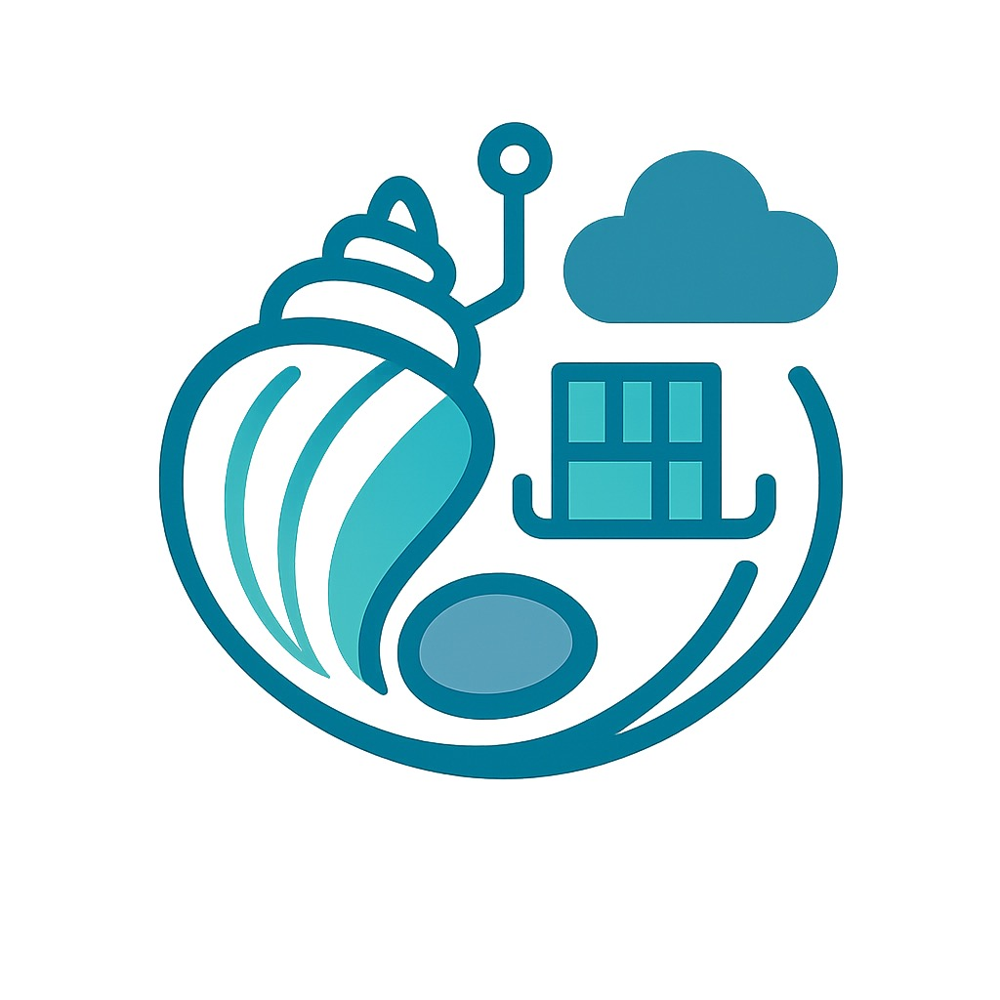

# Cascade - commands flowing over bare rocks

A Python-based shell for debugging containers using Pebble's filesystem operations. This tool provides a command-line interface for interacting with containers through Pebble's API, allowing you to explore filesystems, read files, and gather system information without requiring a shell on the remote side.

## Features

- **Directory Navigation**: Change and track current directory with `cd`/`pwd`
- **Filesystem Operations**: List directories, read files, find files by pattern
- **File Management**: Copy, move, remove files and directories
- **File Information**: Get detailed file statistics and metadata
- **System Information**: View processes, disk usage, environment variables, user info, resource limits
- **Network Information**: View network interfaces, connections, routing, and ARP tables
- **Process Management**: Read-only process inspection and signal information
- **Remote Command Execution**: Execute any command available in the container
- **Text Processing**: Search files with grep, count with wc, sort lines, extract columns with cut
- **Advanced Shell Features**: Pipes, redirection, command chaining, globbing, variables
- **Output and Display**: Echo text with escape sequence support
- **Shell History**: Command history with search, persistent storage, and arrow key navigation
- **Command Aliases**: Define and use command shortcuts and abbreviations
- **Enhanced Input**: Readline support with tab completion and history navigation
- **Interactive Shell**: Easy-to-use command-line interface with contextual prompt

## Installation

### Prerequisites

- Python 3.11 or higher
- [uv](https://astral.sh/uv/) package manager

### Setup

1. Clone the repository:
```bash
git clone https://github.com/tonyandrewmeyer/cascade
cd cascade
```

2. Install uv if not already installed:
```bash
curl -LsSf https://astral.sh/uv/install.sh | sh
```

3. Install dependencies:
```bash
uv sync
```

4. Install pre-commit hooks (optional but recommended):
```bash
uv run pre-commit install
```

## Usage

### Running Cascade

```bash
# Recommended method
uv run cascade

# Alternative methods
uv run python -m pebble_shell
uv run python scripts/run_shell.py

# With custom socket path
uv run cascade --socket /path/to/pebble.sock
```

### Example Session

```
$ uv run cascade
Pebble Debug Shell
Type 'help' for available commands, 'exit' to quit.
Connected to Pebble successfully!
Readline support enabled (use arrow keys for history, tab for completion)

pebble:/> ls
drwxrwxrwx 0        0             0 Jan 01 12:00 bin
drwxrwxrwx 0        0             0 Jan 01 12:00 etc
drwxrwxrwx 0        0             0 Jan 01 12:00 home

pebble:/> alias ll='ls -la'
alias ll='ls -la' added

pebble:/> ll /etc
# Shows detailed listing...

pebble:/> cd /etc
pebble:/etc> pwd
/etc

pebble:/etc> history
    1 ls
    2 alias ll='ls -la'
    3 ll /etc
    4 cd /etc
    5 pwd

pebble:/etc> history -s
History Statistics:
  Total commands: 5
  Unique commands: 5
  Most used command: ls (1 times)
  History file: /tmp/.pebble_shell_history

pebble:/etc> # Use arrow keys to navigate history
pebble:/etc> # Use tab completion for commands and paths

pebble:/etc> exit
```

pebble:/etc> ls
-rwxrwxrwx 0        0            12 Jan 01 12:00 hostname
-rwxrwxrwx 0        0           157 Jan 01 12:00 passwd
-rwxrwxrwx 0        0            85 Jan 01 12:00 group

pebble:/etc> cat hostname
mycontainer

pebble:/etc> whoami
root

pebble:/etc> id
uid=0(root) gid=0(root)

pebble:/etc> grep root passwd
root:x:0:0:root:/root:/bin/bash

pebble:/etc> wc passwd
      3       3     157 passwd

pebble:/etc> echo "Hello from Pebble shell!"
Hello from Pebble shell!

pebble:/etc> cut -f 1 -d: passwd
root
daemon
bin
sys

pebble:/etc> sort -r passwd | head -3
sys:x:3:3:sys:/dev:/usr/sbin/nologin
root:x:0:0:root:/root:/bin/bash
daemon:x:1:1:daemon:/usr/sbin:/usr/sbin/nologin

pebble:/etc> ulimit -a | head -5
Resource limits:
Resource                     Soft Limit    Hard Limit    Units
----------------------------------------------------------------------
Max cpu time                  unlimited     unlimited    seconds
Max file size                 unlimited     unlimited    bytes

pebble:/etc> ps | head -5
Process information from /proc:
PID     CMD
----------------------------------------
1       /sbin/init
2       [kthreadd]

pebble:/etc> kill -l | head -3
Available signals:
   1) SIGHUP
   2) SIGINT

pebble:/etc> echo "Hello World" > /tmp/test.txt
Error: Redirection not supported, but you can use:

pebble:/etc> touch /tmp/test.txt
created '/tmp/test.txt'

pebble:/etc> cp passwd /tmp/passwd.backup
'/etc/passwd' -> '/tmp/passwd.backup'

pebble:/etc> mkdir /tmp/mydir
created directory '/tmp/mydir'

pebble:/etc> mv /tmp/test.txt /tmp/mydir/
'/tmp/test.txt' -> '/tmp/mydir/test.txt'

pebble:/etc> ls /tmp
drwxrwxrwx 0        0             0 Jan 01 12:00 mydir
-rwxrwxrwx 0        0           157 Jan 01 12:00 passwd.backup

pebble:/etc> rm /tmp/passwd.backup
removed '/tmp/passwd.backup'
```

## Development

### Adding New Commands

1. Create a new command class inheriting from `Command` in the appropriate module
2. Implement the `execute` method
3. Add the command to the shell's command registry in `shell.py`
4. Add tests for the new command

Example:
```python
from .base import Command

class MyCommand(Command):
    def execute(self, client, args):
        # Your command implementation
        pass
```

### Testing

The project uses pytest for testing:

```bash
# Run all tests
uv run pytest

# Run with coverage
uv run pytest --cov=src/pebble_shell

# Run specific test file
uv run pytest tests/test_shell.py

# Run tests with verbose output
uv run pytest -v
```

## Configuration

### Socket Path

By default, the shell looks for Pebble sockets at `/charm/containers/*/pebble.sock`. You can specify a custom path:

```bash
uv run cascade --socket /custom/path/pebble.sock
```

## Troubleshooting

### Connection Issues

If you see "Failed to connect to Pebble":
1. Verify the Pebble socket path exists
2. Check that you have permission to access the socket
3. Ensure Pebble is running in the container

## Contributing

1. Fork the repository
2. Create a feature branch
3. Make your changes with tests
4. Run the test suite and linting
5. Submit a pull request

Please ensure your code follows the project's style guidelines and includes appropriate tests.

## License

This project is licensed under the MIT License - see the LICENSE file for details.

## Related Projects

- [Pebble](https://documentation.ubuntu.com/pebble) - The service manager this tool interfaces with
- [ops](https://ops.readthedocs.io/) - Python operator framework providing the Pebble client
